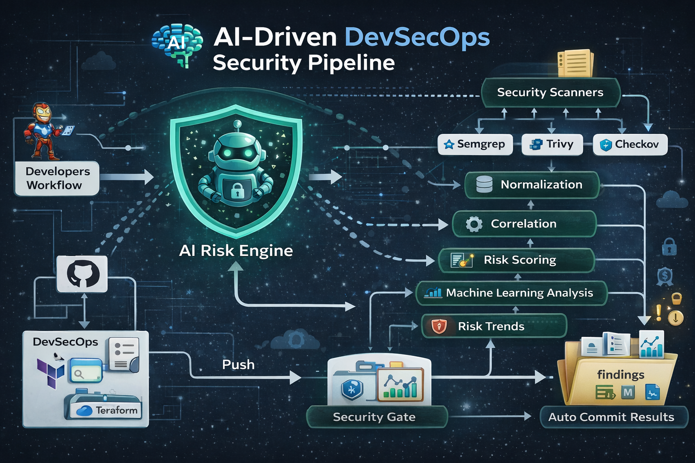

# AI-Assisted DevSecOps Risk Assessment


An **AI-assisted DevSecOps pipeline** that automatically scans application code, infrastructure, and dependencies to identify vulnerabilities, correlate findings across tools, compute explainable risk scores, and enforce security gates inside CI/CD.

The system integrates multiple security scanners and applies **machine learning with explainable risk scoring** to prioritize vulnerabilities and automate security decisions.

---

## Architecture



The pipeline follows a multi-stage flow:

```
Developer Push → Security Scanners → Normalization → Correlation
    → Explainable Risk Scoring → ML Analysis → Visualization → Security Gate
```

**Stage 1 — Security Scanning:** Three complementary tools scan different domains. Semgrep performs static analysis on source code (SAST), Trivy detects vulnerable dependencies (SCA), and Checkov scans Terraform infrastructure-as-code (IaC).

**Stage 2 — Normalization:** Raw outputs from each tool are converted into a unified finding schema with standardized severity scores, enabling cross-tool analysis.

**Stage 3 — Correlation:** Related findings from different tools are grouped using category-based matching (e.g., injection, secrets, container-security). Findings detected by multiple tools receive a severity boost.

**Stage 4 — Risk Scoring:** Each finding is evaluated using a weighted linear model (see Risk Model below).

**Stage 5 — ML Prediction:** A RandomForest classifier trained on augmented data predicts high-risk findings. An Isolation Forest provides anomaly-based scoring as a supplementary signal.

**Stage 6 — Visualization:** Publication-quality charts are generated showing risk distribution, tool contribution by severity, asset risk ranking, and security trends across pipeline runs.

**Stage 7 — Security Gate:** The pipeline enforces configurable thresholds and blocks deployments when risk exceeds acceptable levels.

---

## Risk Scoring Model

Each vulnerability receives a transparent, explainable risk score computed as:

```
risk_score = (w_severity × severity + w_exposure × exposure +
              w_criticality × criticality + w_confidence × confidence +
              w_freshness × freshness) × stage_multiplier
```

### Weights

| Factor | Weight | Description |
|--------|--------|-------------|
| Severity | 0.40 | Normalized severity (0–1), prefers CVSS when available |
| Exposure | 0.20 | Internet-facing (1.0), internal (0.5), unknown (0.3) |
| Criticality | 0.15 | Production (1.0), staging (0.6), dev (0.3) |
| Confidence | 0.15 | Tool reliability — Trivy (0.85), Checkov (0.80), Semgrep (0.75) |
| Freshness | 0.10 | Age decay — today (1.0), <7d (0.8), <30d (0.5), older (0.2) |

### Stage Multipliers

| Stage | Multiplier | Rationale |
|-------|------------|-----------|
| IaC | 1.1× | Infrastructure misconfigs affect the entire platform |
| SCA | 1.0× | Dependency vulnerabilities are externally exploitable |
| SAST | 0.9× | Code-level issues may have limited blast radius |

### Risk Labels

| Score Range | Label |
|-------------|-------|
| 0.75 – 1.00 | CRITICAL |
| 0.55 – 0.74 | HIGH |
| 0.35 – 0.54 | MEDIUM |
| 0.15 – 0.34 | LOW |
| 0.00 – 0.14 | INFO |

---

## Security Gate Thresholds

| Check | Threshold | Behavior |
|-------|-----------|----------|
| Individual finding | ≥ 0.75 | Blocks deployment |
| IaC finding | ≥ 0.70 | Blocks deployment |
| Asset aggregate | ≥ 0.80 | Blocks deployment |
| ML prediction | ≥ 0.80 | Blocks deployment |
| Critical count | > 0 | Zero tolerance |

---

## Prerequisites

- **Python 3.11+**
- **Semgrep** — `pip install semgrep`
- **Trivy** — [install guide](https://aquasecurity.github.io/trivy/latest/getting-started/installation/)
- **Checkov** — `pip install checkov`

Install Python dependencies:

```bash
pip install -r requirements.txt
```

---

## Running Locally

Run the complete pipeline:

```bash
make all
```

Or run individual stages:

```bash
make scan         # Run Semgrep, Trivy, Checkov
make normalize    # Unify finding formats
make correlate    # Group and deduplicate
make score        # Compute risk scores
make ml           # Train ML model and predict
make visualize    # Generate charts
make dashboard    # Interactive HTML dashboard
make sarif        # SARIF report for GitHub Security
make gate         # Apply security gate
```

Run analysis on existing scan results (skip scanning):

```bash
make analyze
```

Run tests:

```bash
make test
```

---

## Interactive Security Dashboard

The pipeline generates a self-contained HTML dashboard that opens in any browser — no server required. It includes:

- **Risk summary cards** with total findings, severity counts, and gate status
- **Doughnut chart** of finding severity distribution
- **Stacked bar chart** of findings per tool, broken down by severity
- **Horizontal bar chart** showing the score breakdown by weight (severity, exposure, criticality, confidence, freshness) for each finding
- **Scatter plot** comparing ML-predicted probability vs rule-based risk score
- **Interactive findings table** with severity filters and click-to-expand score explanations

Generate locally:

```bash
make dashboard
open findings/security_dashboard.html
```

---

## GitHub Security Integration (SARIF)

The pipeline outputs findings in [SARIF v2.1.0](https://sarifweb.azurewebsites.net/) format, which integrates natively with GitHub's **Security → Code scanning alerts** tab. Each finding appears with its risk score, severity level, tool attribution, and file location.

This is uploaded automatically in CI via `github/codeql-action/upload-sarif@v3`. To generate locally:

```bash
make sarif
```

---

## Technology Stack

| Category | Tools |
|----------|-------|
| SAST | Semgrep |
| Dependency Scanning | Trivy |
| Infrastructure Security | Checkov |
| Infrastructure as Code | Terraform (Kubernetes) |
| Programming Language | Python 3.11 |
| ML Libraries | Scikit-learn (RandomForest, IsolationForest) |
| Data Processing | Pandas |
| Visualization | Matplotlib, Chart.js (dashboard) |
| Output Formats | JSON, Markdown, SARIF v2.1.0, HTML |
| CI/CD | GitHub Actions |
| Testing | Pytest |

---

## Repository Structure

```
.
├── app/starbucks/             # Intentionally vulnerable sample app
│   ├── app.py                 # Flask app with SAST-detectable flaws
│   ├── requirements.txt       # Outdated deps for SCA detection
│   └── Dockerfile             # Insecure container config
│
├── terraform/                 # Intentionally risky IaC
│   ├── main.tf                # Kubernetes deployment with misconfigs
│   ├── variables.tf
│   └── outputs.tf
│
├── risk_engine/               # Core analysis pipeline
│   ├── normalize.py           # Multi-tool finding normalization
│   ├── correlate.py           # Cross-tool correlation engine
│   ├── score.py               # Explainable weighted risk model
│   ├── ml_model.py            # ML classification + anomaly detection
│   ├── visualize.py           # Chart generation
│   ├── trend_analysis.py      # Cross-run trend tracking
│   ├── dashboard.py           # Interactive HTML dashboard generator
│   ├── sarif_report.py        # SARIF v2.1.0 output for GitHub Security
│   └── gate.py                # Security gate enforcement
│
├── tests/                     # Pytest test suite
│   ├── test_normalize.py
│   ├── test_correlate.py
│   ├── test_score.py
│   └── test_gate.py
│
├── findings/                  # Generated reports and charts
│
├── .github/workflows/
│   └── security_pipeline.yml  # CI/CD pipeline definition
│
├── requirements.txt           # Python dependencies
├── Makefile                   # Pipeline automation
└── README.md
```

---

## CI/CD Pipeline

The GitHub Actions pipeline runs on every push to `main`:

1. **Security Scans** — Semgrep, Trivy, and Checkov run in parallel
2. **Risk Analysis** — Normalize, correlate, score, ML predict, visualize, dashboard, SARIF
3. **SARIF Upload** — Findings appear in GitHub Security → Code scanning alerts
4. **Security Gate** — Blocks deployment if risk thresholds are exceeded
5. **Commit Reports** — Always commits results back, even if the gate fails

Reports are stored as artifacts and committed to the `findings/` directory.

---

## Sample Application

The `app/starbucks/` directory contains a deliberately vulnerable Flask application with:

- SQL injection via string concatenation
- OS command injection via `os.popen`
- Path traversal through unsanitized input
- Hardcoded secrets and API keys
- Weak cryptography (MD5 password hashing)
- Unsafe YAML deserialization
- Open redirect
- Debug mode enabled in production
- Outdated dependencies with known CVEs

**⚠️ This code is intentionally insecure for demonstration purposes. Do not deploy.**

---

## Author

**MD SOHAIL SHAIKH**
Cybersecurity Case Study Project
